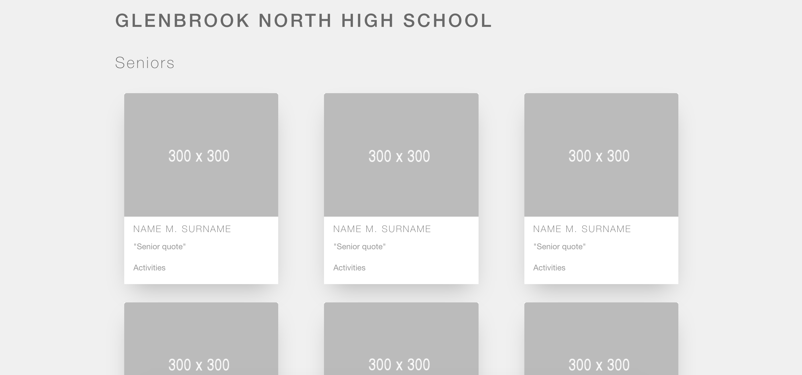

# React Parent-Child Lecture

**GOAL**: You have been tasked with creating a digital yearbook for DPCHS. The page has been given to you as one giant HTML file. Convert the page to React components and render the student data on each card.

## Today's Lab

1. With your partner, brainstorm what your parent and child components should be. Create a diagram of what the structure of the page should look like
2. The page has been given to you as one giant HTML file. Convert the page to React components. **NOTE**: You will have to create a components folder to store your newly created components. Don’t forget to import and export your components.
3. Student data has been provided for you for all seniors. Pass this data to the `<SeniorCard />` that you create and render each individual student using a `map` function.
4. **STRETECH**: Create a file called `juniordata.js`.Add information about the juniors (similar to the data used for seniors) and render this information in the `<JuniorCard />` that you created!
